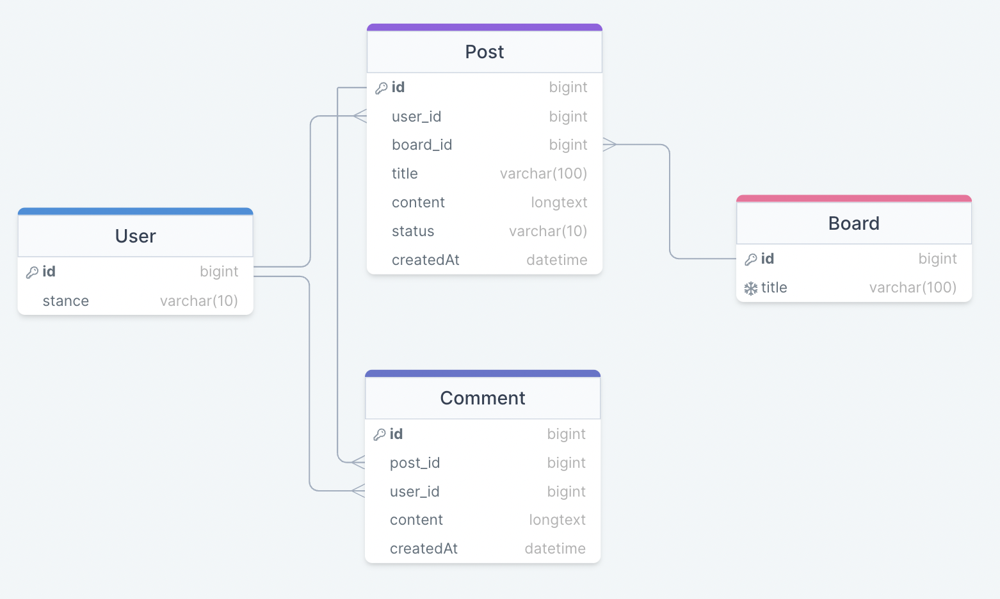
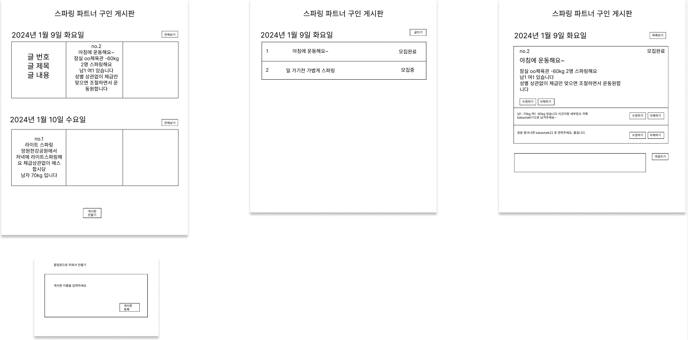
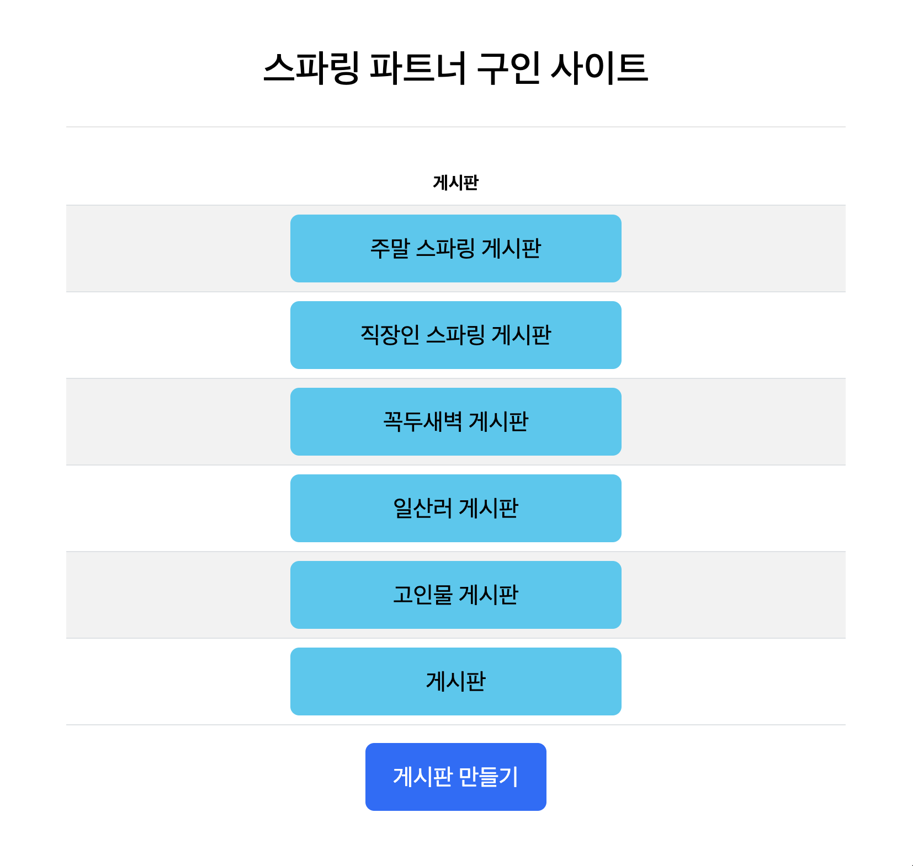
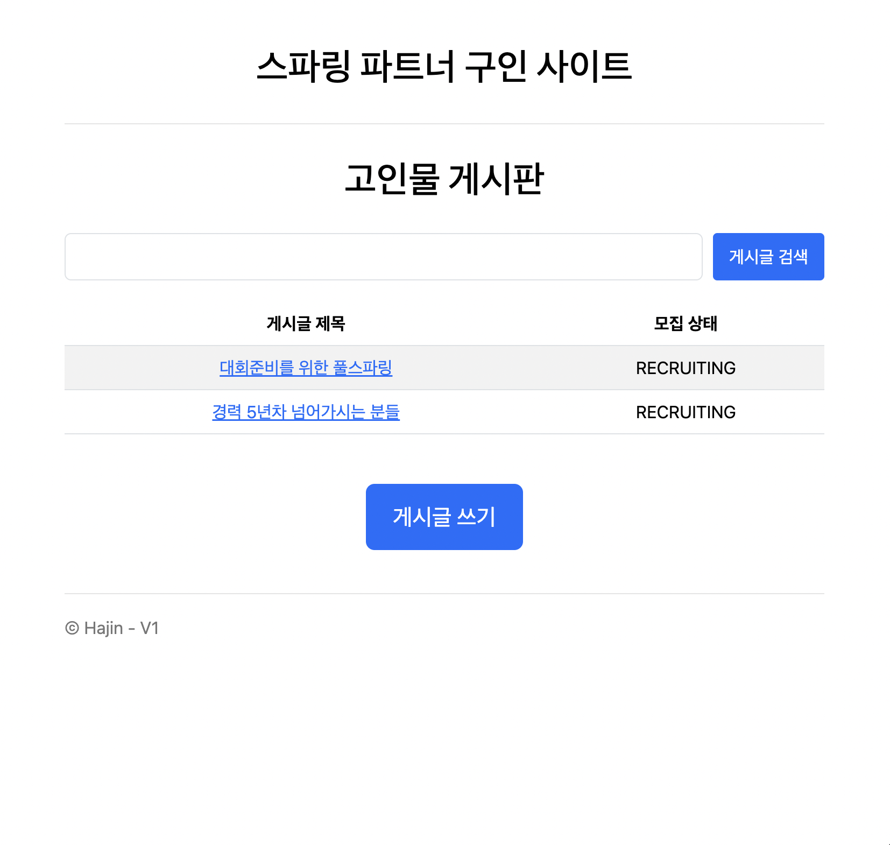
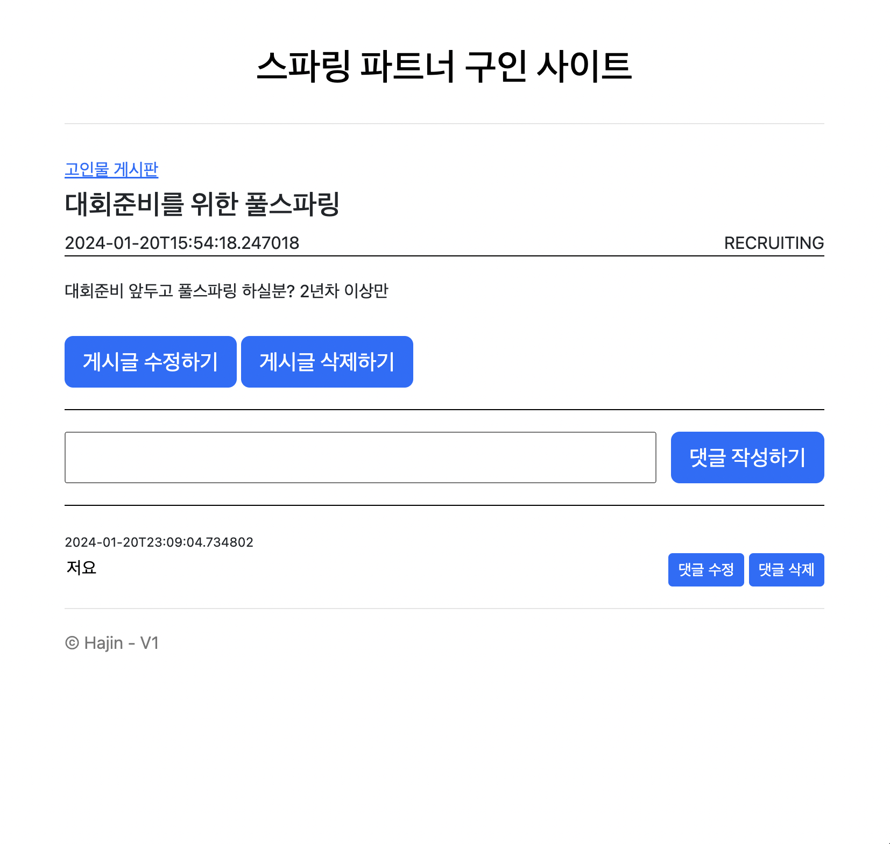
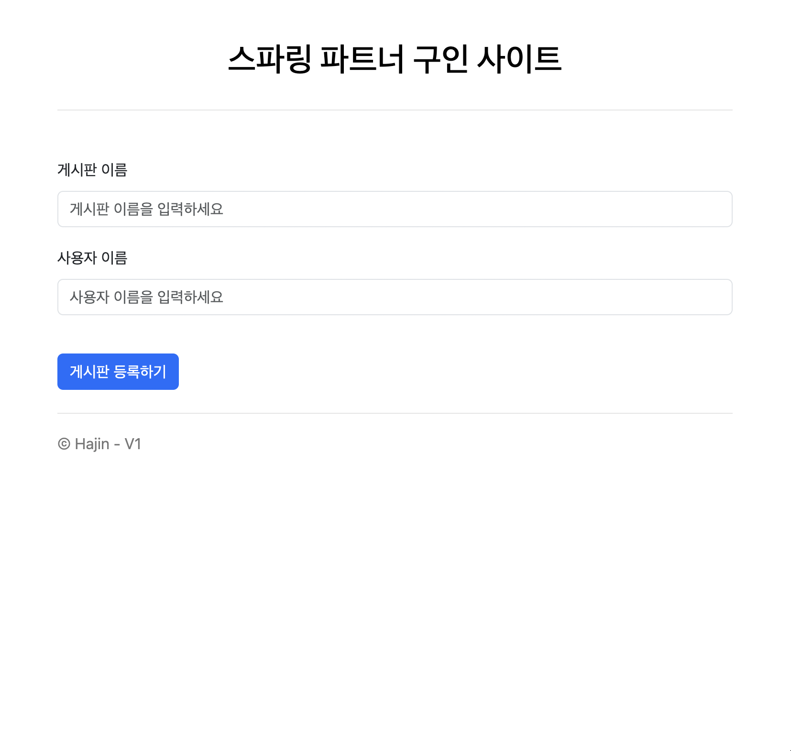

# 복싱 스파링 파트너 구인 사이트
- 주제 : 복싱 스파링 파트너를 찾는 게시판
- 개발 기간 : 2024년 1월 9일 ~ 2024년 1월 20일 (12일)  

## 기술 스택

  

## 기획
### ERD

- 관리자만이 게시판을 [생성, 조회, 수정, 삭제] 할 수 있다.
- 모두가 게시판에 들어가서 게시글을 [생성, 조회] 할 수 있다.
- 작성자만이 본인의 게시글을 [수정, 삭제] 할 수 있다.
- 모두가 게시판에 댓글을 [생성, 조회] 할 수 있다.
- 작성자만이 본인의 댓글을 [수정, 삭제] 할 수 있다.

### 와이어프레임

## 주요 기능
- 게시판 CRUD
  - 회원만 게시판 생성 가능
- 게시글 CRUD
  - 게시글 조회 시, 최신순 정렬
  - 게시글 삭제 시, 하위 댓글도 삭제
  - 검색어가 포함된 제목을 찾아서 게시글 조회
- 댓글 CRUD
  - 댓글 조회 시, 최신순 정렬
  - 상위 게시글 삭제 시, 댓글도 삭제  

## 화면
| 메인 페이지  | 게시글 페이지      |
|---------|--------------|
|  |  |

|게시글 상세 페이지 | 게시판 생성 페이지   |
|---------|--------------|
|| |

